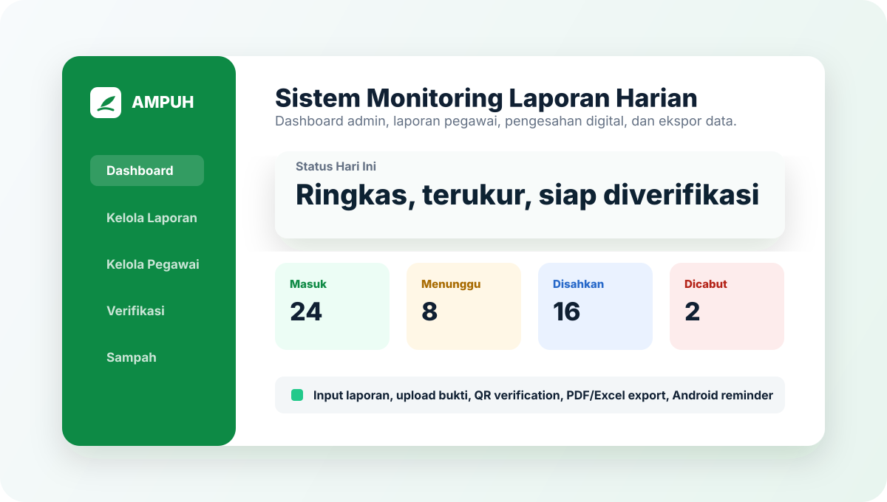

# AMPUH

AMPUH adalah aplikasi monitoring laporan harian pegawai dan guru madrasah berbasis PHP dan MySQL. Aplikasi ini dibuat untuk membantu tata usaha memantau pengiriman laporan, memverifikasi kegiatan, mencetak rekap, dan mengelola data pegawai secara lebih terstruktur.


## Ringkasan

AMPUH mendukung dua peran utama: admin dan pegawai. Pegawai mengirim laporan harian beserta bukti kegiatan, sedangkan admin memverifikasi, mengesahkan, menolak, mencabut pengesahan, mengekspor data, serta mengelola data pegawai dan jabatan.

Repository ini disiapkan sebagai portofolio/source code. Data production, kredensial, file upload asli, dan signing key Android tidak disertakan.

## Fitur Utama

- Login berbasis role untuk admin dan pegawai.
- Dashboard admin dengan ringkasan status laporan.
- Input laporan harian pegawai dengan bukti gambar, PDF, atau video.
- Riwayat laporan pegawai dengan pembatasan edit sesuai status pengesahan.
- Approval per kegiatan, reject, dan cabut pengesahan.
- QR Code dan kode verifikasi dokumen.
- Halaman verifikasi dokumen publik.
- Ekspor laporan dan data pegawai ke PDF/Excel.
- Kelola pegawai, jabatan, dan data terhapus.
- Soft delete dengan halaman sampah dan opsi restore/hapus permanen.
- Android WebView dengan splash screen, progress bar, pull-to-refresh, upload bukti dari kamera/berkas, remember login, dan reminder laporan.

## Preview



Screenshot production tidak disertakan untuk menjaga data pegawai dan bukti laporan tetap privat.

## Teknologi

- PHP native dengan struktur MVC sederhana.
- MySQL/MariaDB.
- Bootstrap SB Admin 2 dengan custom CSS.
- DataTables server-side untuk tabel besar.
- Dompdf untuk ekspor PDF.
- PhpSpreadsheet untuk ekspor Excel.
- Endroid QR Code untuk QR verifikasi.
- Android WebView native Java tanpa Gradle.

## Struktur Singkat

Ringkasan arsitektur tersedia di [docs/ARCHITECTURE.md](docs/ARCHITECTURE.md).

```text
backend/
  controllers/     Controller admin, pegawai, auth, API, verifikasi
  models/          Akses data MySQL
  services/        Logika domain laporan, upload, user
  routes/          Definisi route aplikasi
database/          Migration/schema SQL
mobile/            Source Android WebView dan script build
public/
  assets/          CSS, JS, gambar, vendor frontend
  views/           Template halaman
```

## Instalasi Lokal

Panduan lebih lengkap tersedia di [docs/LOCAL_SETUP.md](docs/LOCAL_SETUP.md).

1. Clone repository.
2. Jalankan `composer install`.
3. Salin `.env.example` menjadi `.env`.
4. Sesuaikan konfigurasi database di `.env`.
5. Import schema dan migration SQL dari folder `database/`.
6. Jalankan server lokal, misalnya:

```powershell
php -S localhost:8000 index.php
```

7. Buka:

```text
http://localhost:8000
```

## Konfigurasi

Contoh `.env`:

```env
APP_URL=http://localhost:8000
APP_DEBUG=true

DB_HOST=localhost
DB_DATABASE=ampuh
DB_USERNAME=root
DB_PASSWORD=
DB_CHARSET=utf8mb4

SESSION_LIFETIME_DAYS=30
```

## Android WebView

Source Android ada di:

```text
mobile/android-webview
```

Build APK debug:

```powershell
powershell -ExecutionPolicy Bypass -File .\mobile\android-webview\build-apk.ps1
```

Build AAB release:

```powershell
powershell -ExecutionPolicy Bypass -File .\mobile\android-webview\build-playstore.ps1
```

File signing key dan hasil build release tidak boleh dipublikasikan ke repository.

## Keamanan Data

Checklist publikasi repository tersedia di [docs/PORTFOLIO_CHECKLIST.md](docs/PORTFOLIO_CHECKLIST.md). Kebijakan keamanan tersedia di [SECURITY.md](SECURITY.md).

Jangan commit file berikut ke repository publik:

- `.env`
- dump database production
- folder upload production
- file APK/AAB release
- Android keystore dan signing properties
- backup zip atau arsip deploy
- screenshot yang memuat data pribadi pegawai

Jika file sensitif pernah ter-commit, hapus dari history Git menggunakan `git filter-repo` atau BFG, lalu rotasi semua credential yang terdampak.

## Status Proyek

Proyek ini disiapkan sebagai studi kasus sistem administrasi internal madrasah. Versi production berjalan di hosting terpisah, sedangkan repository ini ditujukan untuk dokumentasi portofolio dan pengembangan source code.

## Lisensi

Source code ini dipublikasikan untuk kebutuhan portofolio dan review. Penggunaan ulang, redistribusi, atau deployment ulang membutuhkan izin tertulis dari pemilik repository. Lihat [LICENSE](LICENSE).
